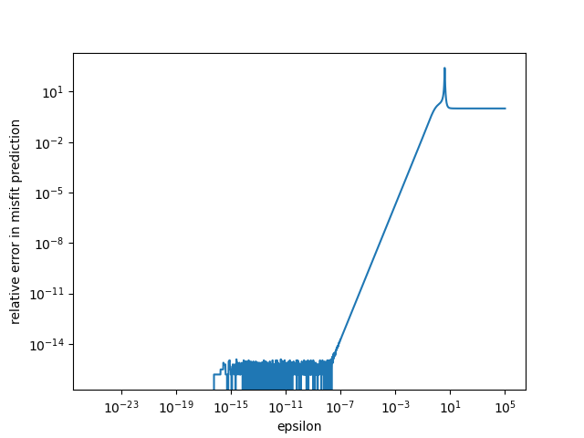

# Hockeyplot

Sometimes in optimization, we want to check if our gradients are correct. One way to do
this is to do a finite difference test. This small code is how one would implement such
a test for a simple target. The plot below shows the result of running this code on the
Himmelblau function for a given initial point and perturbation.

